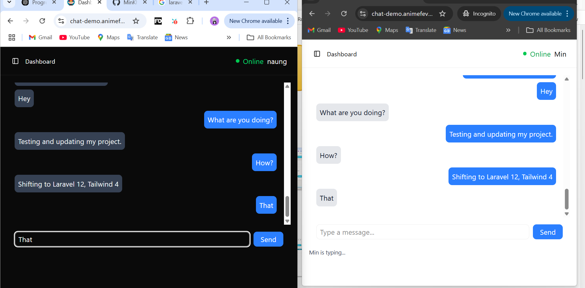

# Real-Time Chat Application

A real-time chat application that allows users to send and receive messages instantly, with additional real-time features like typing indicators and whisper messages.

### 🚀 Live Demo

You can try the deployed version of the Real-Time Chat Application here:

🔗 **[Live Demo – chat-demo.animefeverzone.com](https://chat-demo.animefeverzone.com)**

### 🧪 Test Accounts

You can use the following demo accounts to try out the chat features:

- **Email:** `min@gmail.com`  
  **Password:** `password`

- **Email:** `naung@gmail.com`  
  **Password:** `password`

> 💬 Please use these accounts respectfully. Messages sent here may be visible to other visitors. This demo is for testing and learning purposes only.

## 🚀 Features

- 🔒 User authentication and session handling
- 💬 One-to-one real-time messaging
- ✍️ Typing indicator to show when a user is typing
- 🤫 Whisper messages (private inline messages)
- ⚡ Instant updates using broadcasting

## 📦 Tech Stack (VILT)

- **Backend:** PHP (Laravel 12)
- **Frontend:** Vue.js, Inertia, Typescript, Tailwind (UI)
- **Real-time:** Laravel Echo + Reverb (a Pusher alternative)
- **Database:** MySQL

## ⚙️ Installation

Follow these steps to set up the project locally:

1. **Clone the repository**

```bash
git clone https://github.com/MinKhantNaung/laravel-vue-live-chat-with-reverb.git
cd laravel-vue-live-chat-with-reverb
```

2. **Install PHP dependencies**
```bash
composer install
```

3. Copy .env.example to .env  
```bash
cp .env.example .env
```

4. **Edit your .env file to match your database and app configuration**
nano .env  # or edit manually

5. **Generate application key**
```bash
php artisan key:generate
```

6. **Run database migrations**
```bash
php artisan migrate
```

7. **You need to install Reverb. So, Reverb secret keys will be added in .env** 
```bash
php artisan reverb:install
``` 

7. **Install JavaScript dependencies**
```bash
npm install
```

8. **Build front-end assets**
```bash
npm run build
```

9. **Start Laravel's local development server, queue worker, and Vite development server (Laravel 12+)**
```bash
composer run dev
```

10. **Start the Reverb server**
```bash
php artisan reverb:start
```

## Screenshots 


## 📅 Future Development

I am planning to develop a **simple community group chat app** for my website [animefeverzone.com](https://animefeverzone.com). This app will allow users to join and create community-based chat groups related to anime discussions.

**Mockup for the community group chat (example image):**


## 📚 Related Projects / Credits

This project was inspired by or built upon the following open-source repository:

- 🔗 [Laravel 11 Vue API Stack](https://github.com/qirolab/laravel-reverb-chat) by [@QiroLab](https://github.com/qirolab)  
  A clean implementation of a Laravel 11 + Vue.js chat system using an API-first architecture.

> Parts of this project are adapted from the above repo. Thanks for sharing it with the community!

## 📄 License

This project is open-source and available under the [MIT License](./LICENSE).

## 👤 Author

Developed by [Min Khant Naung](https://github.com/MinKhantNaung). Contributions and suggestions welcome!
